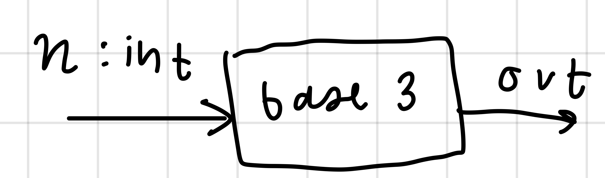

# Solution to Base Problem

**Steps:**
1. Get input
2. Count from 0 to base -1
3. For each base

a. Stop counting if base = 10

b. Continue if base is not 10

5. Count from 1x10 to 1x10 + base -1
6. Count from 2x10 to 1x10 + base -1
7. Continue until Base -1 x10 + base -1
8. Count from 1x100 

| input | output                                   |
|-------|------------------------------------------|
| 10    | 1, 2, 3, 4, 5, 6, 7, 8, 9, 11, 12, 13,   |
| 3     | 1, 2, 10, 11, 12, 20, 21, 22, 100        |
| 5     | 1, 2, 3, 4, 10, 11, 12, 13, 14, 20, 21   |
| 7     | 1, 2, 3, 4, 5, 6, 10, 11, 12, 13, 14, 15 |
